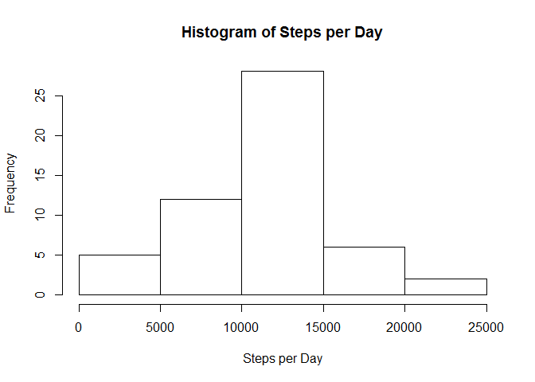
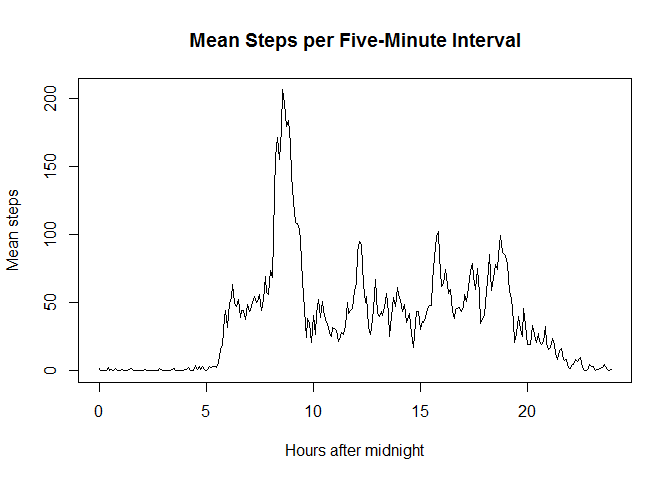
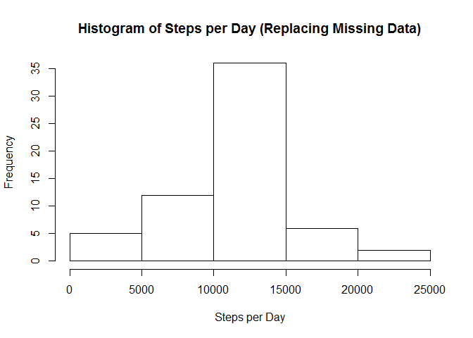
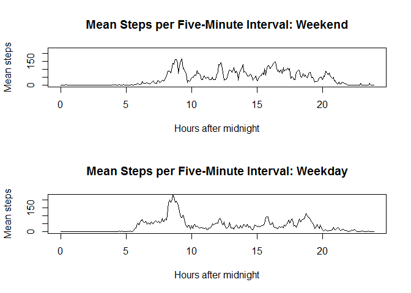

# Reproducible Research: Peer Assessment 1


## Loading the data


```r
setwd("C:/Users/Steve/Desktop/RP_Project1")
activity <- read.csv ("activity.csv")
```

## What is mean total number of steps taken per day?


```r
## Calculate total number of steps per day and create histogram.
steps_per_day = tapply(activity$steps, activity$date, sum)
hist (steps_per_day, main = "Histogram of Steps per Day",xlab = 'Steps per Day')
```

 

```r
## Calculate mean and median of total number of steps per day.
## Print results.
mean_steps_per_day <- round(mean (steps_per_day, na.rm = TRUE))
median_steps_per_day <- round(median (steps_per_day, na.rm = TRUE))
mean_label <- paste ("Mean =",mean_steps_per_day,"steps per day")
median_label <- paste ("Median =", median_steps_per_day,"steps per day")
print (mean_label)
```

```
## [1] "Mean = 10766 steps per day"
```

```r
print(median_label)
```

```
## [1] "Median = 10765 steps per day"
```

## What is the average daily activity pattern?


```r
## Calculate mean number of steps per five-minute interval.
## Plot time series.
steps_per_interval = tapply(activity$steps, activity$interval, 
                            mean, na.rm = TRUE)
x_axis_minutes <- seq (from = 0, to = 1435, by = 5)
x_axis_hours <- x_axis_minutes/60
plot (x = x_axis_hours, y = steps_per_interval, type = "l", 
        xlab = "Hours after midnight", ylab = "Mean steps", 
        main = "Mean Steps per Five-Minute Interval")
```

 

```r
## Determine which five-minute interval has maximum number of steps.
## Print result.
max_interval <- which.max (steps_per_interval)
hours_max_interval <- floor((max_interval-1)/12)
minutes_max_interval <- 60*((max_interval-1)/12 - hours_max_interval)
max_steps_label <- paste("Maximum number of steps occurs between ",
                         hours_max_interval,":",minutes_max_interval," and ",
                         hours_max_interval,":",minutes_max_interval + 5, 
                         " (24-hour clock).",sep="")
print (max_steps_label)
```

```
## [1] "Maximum number of steps occurs between 8:35 and 8:40 (24-hour clock)."
```

## Imputing missing values

Missing values are replaced with the mean for that five-minute time interval.


```r
## Determine number of missing values.
## Print result.
number_missing_values <- sum(is.na(activity$steps))
missing_values_label <- paste ("Number of missing values =",
                               number_missing_values)
print (missing_values_label)
```

```
## [1] "Number of missing values = 2304"
```

```r
## Replace missing values with mean for that five-minute interval.
loop <- length(activity$steps)
for (i in 1:loop) {
              if (is.na(activity$steps[i]) == TRUE) {
                interval_number = 1 + 12*floor(activity$interval[i]/100) +
                (activity$interval[i] - 100*floor(activity$interval[i]/100))/5
                activity$steps[i] <- steps_per_interval[interval_number]
              }
     }

## Repeat histogram, mean and median number of steps 
## for data set with missing values replaced.
steps_per_day = tapply(activity$steps, activity$date, sum)
hist (steps_per_day, xlab = "Steps per Day",
      main = "Histogram of Steps per Day (Replacing Missing Data)")
```

 

```r
mean_steps_per_day <- round(mean (steps_per_day, na.rm = TRUE))
median_steps_per_day <- round(median (steps_per_day, na.rm = TRUE))
mean_label <- paste ("Mean (replacing missing data) =",mean_steps_per_day,
                     "steps per day")
median_label <- paste ("Median (replacing missing data) =", 
                       median_steps_per_day,"steps per day")
print (mean_label)
```

```
## [1] "Mean (replacing missing data) = 10766 steps per day"
```

```r
print(median_label)
```

```
## [1] "Median (replacing missing data) = 10766 steps per day"
```

Replacing missing values has very little effect on the histogram, mean or
median of the total number of steps per day.

## Are there differences in activity patterns between weekdays and weekends?


```r
## Create new factor variable with two levels "weekday" and "weekend."
day_of_week <- weekdays (as.Date(activity$date))
day <- vector ()
for (i in 1:loop) {
               if (day_of_week[i] == "Saturday" | day_of_week[i] == "Sunday") {
               day[i] <- "weekend"}
               else {(day[i] <- "weekday")}
                }
activity <- cbind (activity, day)

## Calculate mean number of steps per five-minute interval
## separately for weekdays and weekends.
steps_per_interval_weekend <- tapply(activity$steps [activity$day == "weekend"],
                                   activity$interval[activity$day == "weekend"],
                                   mean, na.rm = TRUE)
steps_per_interval_weekday <- tapply(activity$steps [activity$day == "weekday"], 
                                   activity$interval[activity$day == "weekday"],
                                   mean, na.rm = TRUE)

## Create panel plot with separate time series for weekends and weekdays.
par (mfrow = c(2,1))
plot (x = x_axis_hours, y = steps_per_interval_weekend, type = "l", 
      xlab = "Hours after midnight", ylab = "Mean steps", 
      main = "Mean Steps per Five-Minute Interval: Weekend", ylim = c(0,225))
plot (x = x_axis_hours, y = steps_per_interval_weekday, type = "l", 
      xlab = "Hours after midnight", ylab = "Mean steps", 
      main = "Mean Steps per Five-Minute Interval: Weekday", ylim = c(0,225))
```

 
